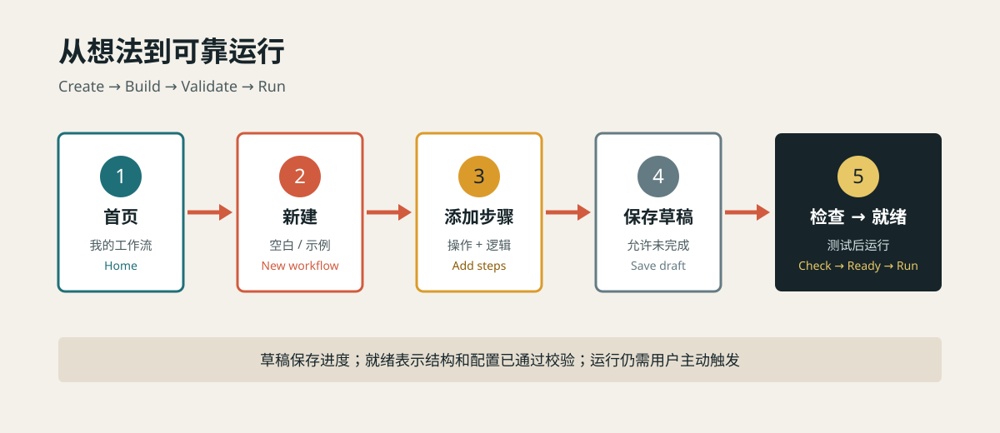
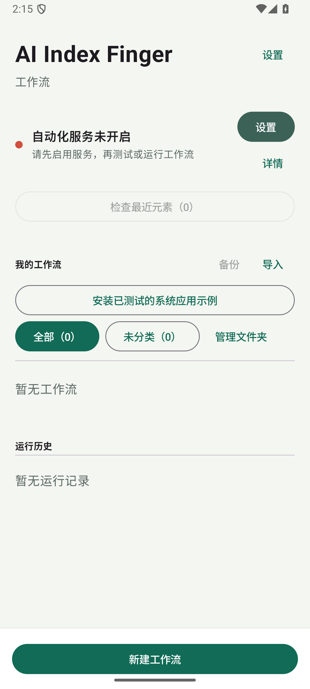
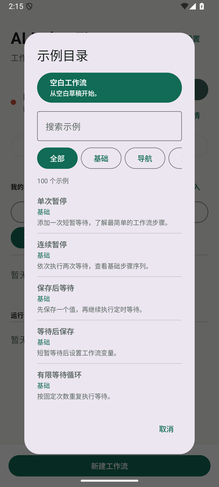
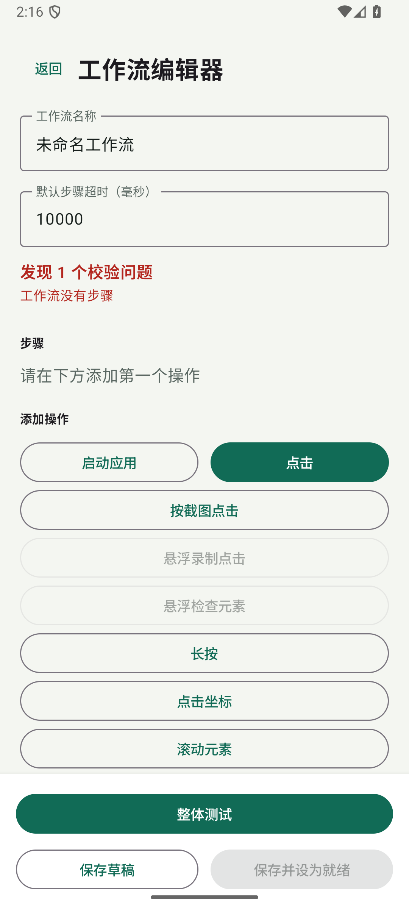
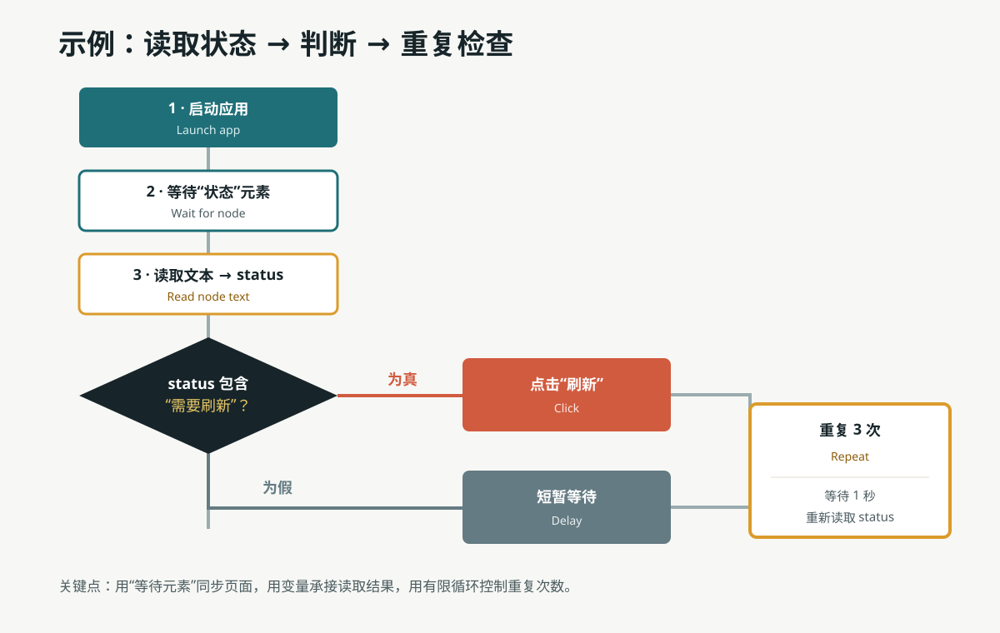
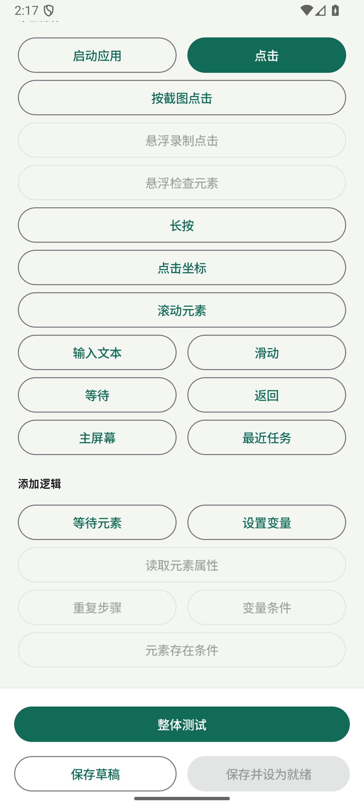
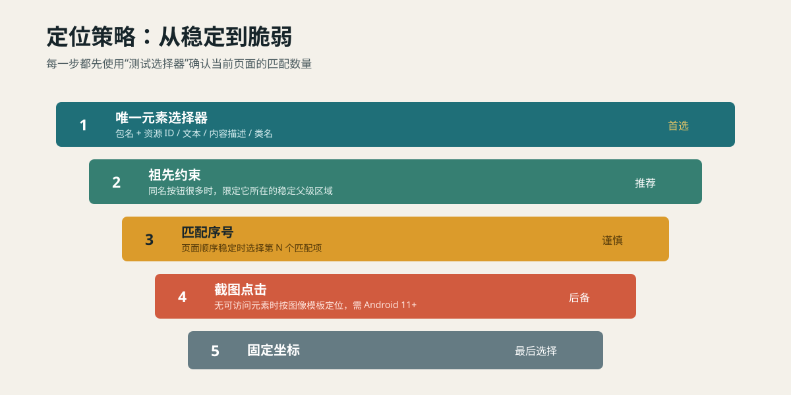
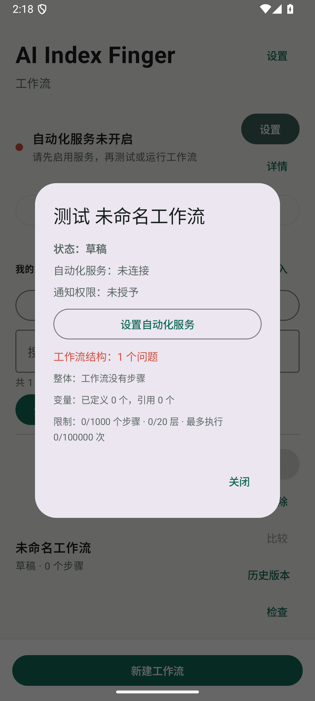
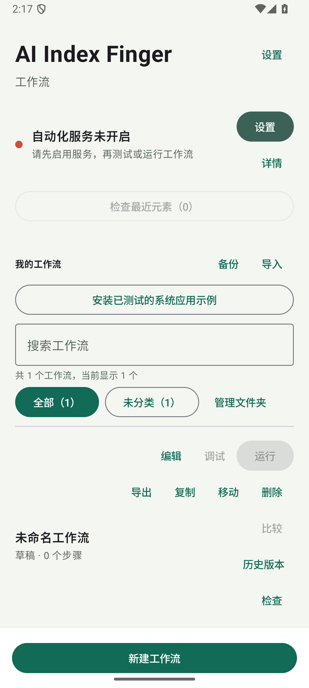

# AI Index Finger 工作流图文教程

本教程适用于 `0.33.0-beta.9`。它从新建工作流开始，介绍每一种操作、变量与条件逻辑、循环、检查、调试和常见定位问题。

文中的手机截图来自 API 36 模拟器上的简体中文界面。不同设备的尺寸和系统设置页面可能略有区别。

> AI Index Finger 通过 Android 无障碍服务执行你主动创建和启动的工作流。界面信息和运行历史保存在本机；应用没有网络权限。请只自动化你有权操作的应用和数据。

## 1. 先理解一个工作流

工作流是一个从上到下执行的步骤列表。普通步骤执行操作，逻辑步骤包含子步骤并决定执行顺序。

一个可靠工作流通常遵循这个顺序：

1. **启动应用**，明确目标应用。
2. **等待元素**，不要假设页面立即加载完成。
3. **点击、输入或读取元素**。
4. 必要时使用**条件判断**和**重复步骤**。
5. 先保存为草稿，使用**检查**和**整体测试**修正问题。
6. 校验通过后选择**保存并设为就绪**，再从首页运行。

## 2. 准备自动化权限

1. 在首页打开 **设置**。
2. 选择 **自动化权限** > **打开无障碍设置**。
3. 阅读应用内说明并确认后，在 Android 设置中启用 AI Index Finger。
4. 回到应用。

	

首页红点和“自动化服务未开启”表示当前不能测试或运行，但仍然可以创建和编辑草稿。

工作流只有在你点击**运行**或**调试**后才会执行。调度功能只发送提醒，不会静默执行自动化。

## 3. 新建第一个工作流

1. 在首页点击 **新建工作流**（New workflow）。
2. 选择空白工作流。也可以从示例目录创建草稿，再修改其中步骤。
3. 在**工作流名称**中输入容易识别的名称，例如“读取页面状态”。
4. 保留默认步骤超时，除非目标应用加载较慢。
5. 点击 **添加操作**，先添加**启动应用**并选择目标应用。
6. 再添加**等待元素**，选择目标页面上稳定的元素。
7. 继续添加业务步骤。
8. 初次编辑时选择**保存草稿**。草稿不能运行或调度，但可以保留未完成配置。

| 选择创建方式 | 空白工作流编辑器 |
| --- | --- |
|  |  |

空白工作流会立即显示“工作流没有步骤”。这是正常的草稿校验提示；添加并配置步骤后才能设为就绪。

## 4. 完整示例：读取状态并按条件处理

下面的例子展示操作、变量、判断和循环如何组合。假设目标页面有一个状态文本和一个“刷新”按钮。

### 步骤 A：启动和等待

1. 添加 **启动应用**，选择目标应用。
2. 添加 **等待元素**，定位状态文本，设置为“必须存在”。

“等待元素”比固定等待更可靠：页面提前加载时可以立即继续，加载较慢时会在超时范围内等待。

### 步骤 B：读取元素到变量

1. 添加 **读取元素属性**。
2. 选择状态文本。
3. 属性选择“文本”或“文本或描述”。
4. 输出变量名填写 `status`。

变量名区分用途即可，不要带空格。变量只在本次运行中使用。

### 步骤 C：增加条件判断

1. 点击 **添加逻辑** > **值比较**。
2. 左值选择变量 `status`。
3. 运算选择“包含”。
4. 右值填写 `需要刷新`。
5. 打开条件的**为真**分支，添加点击“刷新”按钮的步骤。
6. 打开**为假**分支，添加短暂等待或其他处理。

值比较的左右两侧都可选择固定值、另一个变量或变量模板，并支持等于、不等于、包含、不包含。**元素存在条件**则直接根据一个元素当前是否存在选择分支。

### 步骤 D：重复检查

1. 添加 **重复步骤**，次数设为 `3`。
2. 进入其**嵌套步骤**。
3. 添加“等待 1000 毫秒”。
4. 添加“读取元素属性”，继续写入 `status`。
5. 根据需要在循环内加入条件判断。

循环次数范围是 1 到 10,000，但移动端自动化应保持次数有限且可预测。不要用大循环代替正确的“等待元素”。

## 5. 所有操作怎么用

	

截图中的灰色入口表示当前缺少前置步骤。例如空工作流还没有可包装的步骤，因此“重复步骤”和条件入口暂时不可用。“读取元素属性”可直接手工填写选择器，也可从截图或最近观察元素中选取。

| 操作 | 用途 | 关键配置 | 建议 |
| --- | --- | --- | --- |
| 启动应用 | 打开目标应用 | 从已安装应用中选择 | 通常放在第一步 |
| 点击 | 点击无障碍元素 | 元素选择器 | 优先于坐标点击 |
| 按截图点击 | 按图像模板查找并点击 | 目标应用、截图区域、匹配阈值 | Android 11+；适合没有可访问元素的界面 |
| 长按 | 长按无障碍元素 | 元素选择器 | 先确认元素支持长按 |
| 输入文本 | 向文本框写入文字 | 文本框、固定文本或变量、输入方式 | `SetText` 更稳定；Paste 会临时使用并安全恢复剪贴板 |
| 读取元素属性 | 把元素内容写入变量 | 元素、属性、变量名 | 可读取文本、描述、资源 ID、类名 |
| 滑动 | 执行屏幕手势 | 起点、终点、时长 | 适合固定方向手势 |
| 滚动元素 | 让可滚动控件前进或后退 | 元素、方向 | 优先于固定坐标滑动 |
| 点击坐标 | 点击固定屏幕位置 | X、Y | 对分辨率和布局变化敏感，作为后备方案 |
| 系统操作 | Android 导航 | 返回、主屏幕、最近任务 | “主屏幕”会离开目标应用 |
| 等待元素 | 等到元素出现或消失 | 元素、必须存在/不存在、超时 | 页面同步的首选方式 |
| 等待 | 固定暂停 | 毫秒数 | 只用于动画或确实需要的间隔 |

### 点击录制

录制模式可以捕获多个点击、返回、主屏幕、启动应用和滑动。可唯一识别的控件会保存为控件目标；无法可靠识别时才退回坐标。录制完成后逐条检查目标模式，尤其注意“坐标”记录。

## 6. 所有逻辑怎么用

| 逻辑 | 行为 | 典型用途 |
| --- | --- | --- |
| 设置变量 | 保存固定值、另一变量或模板值 | 准备输入内容或状态标记 |
| 读取元素属性 | 从当前界面采集值到变量 | 获取标题、状态、描述或资源 ID |
| 值比较 | 比较两个值，执行为真/为假分支 | 根据读取结果决定下一步 |
| 元素存在条件 | 根据元素是否存在执行分支 | 处理弹窗、登录状态或可选页面 |
| 重复步骤 | 按固定次数执行嵌套步骤 | 有限重试、翻页或批量处理 |

逻辑块可嵌套。进入**为真**、**为假**或**重复**分支后，可继续添加、编辑、复制、上移、下移和删除步骤；使用**上一级**返回外层。

## 7. 选择器：让点击不点错

元素步骤至少需要资源 ID、文本、内容描述或类名中的一项。包名用于限制目标应用；多个元素仍然相同时，可以使用匹配序号或祖先约束。点击、长按、输入文本、读取元素属性、滚动元素、等待元素和元素存在条件均可手工编辑这些完整选择器字段。

推荐顺序：

1. 打开目标应用一次，再回到编辑器，从**最近观察到的元素**选择。
2. 编辑点击或长按步骤时，可使用**测试选择器**确认匹配数量；其他元素步骤保存前检查完整字段和匹配序号。
3. 匹配多个时，优先补充资源 ID、内容描述或祖先约束。
4. 也可从首页打开**悬浮检查元素**，在目标应用中点击**拾取**，查看可靠性和祖先约束候选，然后选择**使用选择器**。
5. 只有界面没有可靠无障碍元素时，才使用截图点击或坐标。

匹配序号从当前匹配列表选择目标，但页面插入新元素后序号可能变化；祖先约束通常更适合重复列表中的同名按钮。

## 8. 超时和失败策略

每一步默认使用工作流的**默认步骤超时**，也可以单独覆盖。失败时有三种策略：

- **停止工作流**：默认选择，适合关键步骤。
- **继续下一步**：该步骤失败也继续，适合可选弹窗。
- **重试**：可重试 1 到 10 次，并设置重试间隔，适合短暂不稳定操作。

不要对永久错误盲目重试。例如选择器写错时，应先修正选择器，而不是增加重试次数。

## 9. 检查、测试和调试

### 保存前校验

编辑器顶部会列出校验问题。点击**编辑步骤**可直接进入对应的顶层或嵌套步骤。空工作流、无效超时、未定义变量和配置不完整的选择器都会阻止设为就绪。

### 检查

首页工作流菜单中的**检查**不会执行操作，也不会写入运行历史。它会检查：

- 草稿/就绪状态和结构限制；
- 无障碍服务连接；
- 应用是否可启动；
- 当前页面的选择器匹配数量；
- 截图点击支持情况；
- 通知权限等前置条件。

选择器结果只代表无障碍服务当前看到的页面，因此检查前要把目标应用停在正确页面。

	

上图中的**检查**只生成报告，没有执行任何点击、输入或系统操作。报告会明确列出草稿状态、权限状态、结构问题和执行上限。

### 整体测试与调试

- **整体测试**：从编辑器测试当前工作流。
- **调试**：从首页逐步执行，使用“下一步”观察每一步。
- **停止**：立即请求停止当前执行。
- **运行历史**：查看结果、失败步骤、耗时和尝试次数；失败记录可以重新打开对应步骤。

## 10. 草稿、就绪与运行

	

- **保存草稿**：允许保存不完整工作流，不能运行或调度。
- **保存并设为就绪**：只有全部校验通过才成功。
- **运行**：需要就绪状态和已连接的无障碍服务。
- **调度**：创建本地通知提醒，到点后仍由用户主动打开并运行工作流。

## 11. 常见问题

### 如何运行系统闹钟验证脚本

首页安装系统示例后，进入 Clock 文件夹。两条验证脚本用于 Google Clock 9.0 参考环境：

1. 在 Clock 中手工创建一条专用闹钟，将名称设为 `AI_INDEX_FINGER_CLOCK_VALIDATION_V1`。
2. 关闭该闹钟，并清除重复日期。确认只有一条闹钟使用这个名称。
3. 运行“将 AI_INDEX_FINGER_CLOCK_VALIDATION_V1 设为 10:37”。
4. 运行“将 AI_INDEX_FINGER_CLOCK_VALIDATION_V1 铃声设为静音”。
5. 检查运行历史。两条流程都会读取并验证最终值，并确保保存后的专用闹钟仍然关闭。

脚本不会创建或删除闹钟，也不会操作没有该精确名称的闹钟。不要把个人闹钟改成这个测试名称。其他品牌或版本的系统时钟可能使用不同控件，运行前应先使用**检查**确认选择器。

### “当前窗口中没有匹配元素”

确认目标应用位于正确页面并已被无障碍服务观察；检查包名、文本和资源 ID 是否变化。动态文本可改用“包含”。

### “选择器不唯一”

增加稳定属性，使用 F12 悬浮检查器提供的祖先约束，最后才考虑匹配序号。

### 点击了错误控件

避免只使用常见文本，例如“确定”。同时限制包名、资源 ID或父级区域，并重新执行**测试选择器**。

### 输入文本失败

确认目标元素是可编辑文本框。先尝试 SetText；目标应用不支持时再选择 Paste。变量输入前确认变量已由“设置变量”或“读取元素属性”定义。

### 工作流无法设为就绪

展开编辑器顶部的校验问题，逐项点击**编辑步骤**。不要通过删除关键步骤或改成“失败后继续”来掩盖配置错误。

## 12. 推荐练习顺序

1. 创建“等待 2 秒后返回主屏幕”，熟悉启动、等待和系统操作。
2. 创建“读取标题并判断”，熟悉选择器、变量和条件分支。
3. 创建“重复刷新 3 次”，熟悉嵌套步骤和有限循环。
4. 在重复元素页面使用悬浮检查器，比较匹配序号与祖先约束。
5. 最后再尝试截图点击、坐标点击和复杂重试。

应用内的示例目录也包含“重复等待”和“变量与条件判断”等安全草稿。使用示例会创建新的草稿，不会自动执行，也不会覆盖已有工作流。